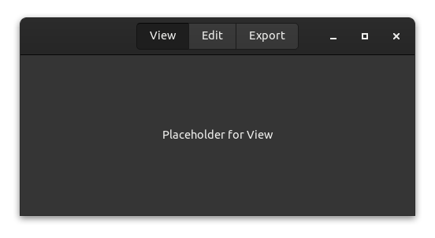
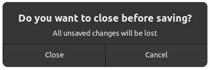

# Components

Technically, we already used components in the previous chapters.
So far, we've only used one component per application, but in this chapter, we're going to use multiple components to structure our app.

Components are independent parts of your application that can communicate with each other.
They are used in a parent-child model: The main app component can have several components and each component can have child components and so on.
This means that each component has a parent, except for the main app component which is at the top of this tree structure.

To showcase this, we will create a small application which opens a dialog when the user tries to close it.
The header bar and the dialog will be implemented as standalone components.





## When to use components

Components are very useful for separating parts of the UI into smaller, more manageable parts.
They are not necessary but for larger applications, they can be very helpful.

## Message handling

Components store their child components inside the model as a `Controller<ChildModel>` and handle output messages in the `init` function by calling the `forward` method.

```rust,no_run,noplayground
{{#include ../examples/components.rs:forward }}
```

The `forward` method will redirect the output messages from the child component and transform them into the parent's input messages.

> Components are independent from each another so a component can be used easily with several different parent components.
> Therefore, the child component doesn't know which type its parent component will have.
> Thus, the `forward` method allows the parent component to transform the output messages of child components to a message type it can handle properly.
>
> In this example, `HeaderOutput` messages are translated into `AppMsg`.

# Example application

Let's write a small example app to see how components can be used in action. For this example, we write parts of an app that can edit images.

> The app we will write in this chapter is also available [here](https://github.com/AaronErhardt/relm4/blob/main/relm4-examples/examples/components.rs). Run `cargo run --example components` from the [example directory](https://github.com/AaronErhardt/relm4/tree/main/relm4-examples) if you want to see the code in action.

## The header bar

Our first component will be a header bar. There are not a lot of advantages for writing this as component except for reducing the complexity in other parts of our UI.

The header bar will have three buttons for three modes that our application can have:

+ **View**: View the image.
+ **Edit**: Edit the image.
+ **Export**: Export the image in different formats.

We will not implement the actual functionality, but instead use placeholders to keep things simple.

### The model

Usually you want to store everything that affects only your component in the state of the component. However, in this case, there is no state that can be stored in the component, but only state that affects the root component (app). Therefore, we leave the model empty and only send messages to the root component.

```rust,no_run,noplayground
{{#include ../examples/components.rs:header_model }}
```

The message type allows us to switch between the modes.

```rust,no_run,noplayground
{{#include ../examples/components.rs:header_msg }}
```

Our component needs no `update` method, because the `view` can emit the component's output messages as part of its click signal handlers, as we will see in the next section.

### The widgets

There's nothing special about widgets of a child component. The only difference to the main app component is that the root widget doesn't need to be a `gtk::Window`. Instead, we use a `gtk::HeaderBar` here, but theoretically the root widget doesn't even need to be a widget at all (which can be useful in special cases).

```rust,no_run,noplayground
{{#include ../examples/components.rs:header_widgets }}
```

## The close alert

As with a normal application used to edit files, we want to notify the user before they accidentally close the application and discard all progress. For this &mdash; you might have guessed it already &mdash; we will use another component.

### The model

The state of the dialog only needs to store whether or not it's hidden.

```rust,no_run,noplayground
{{#include ../examples/components.rs:dialog_model }}
```

The message contains three options:

+ **Show** is used by the parent to display the dialog.
+ **Accept** is used internally to indicate that the user agreed to close the application.
+ **Cancel** is used internally to indicate that the user changes his mind and doesn't want to close the application.

```rust,no_run,noplayground
{{#include ../examples/components.rs:dialog_msg }}
```

### The widgets

Unlike the last component, the `DialogModel` component doesn't send its output messages from a signal handler. Instead, the `response` signal handler sends *input* messages to itself, handles them in `update`, and then sends output messages if necessary. This is a common pattern for more complex components.

> If your component accepts non-internal inputs as well, you may want to mark the internal variants as `#[doc(hidden)]` so that users of your component know they're only intended for internal use.

```rust,no_run,noplayground
{{#include ../examples/components.rs:dialog_widgets }}
```

In the `update` implementation, we match the input messages and emit an output if needed.

```rust,no_run,noplayground
{{#include ../examples/components.rs:dialog_update }}
```

## The main app

Now all parts come together to form a single app.

### The model

First, let's define the model of the main app and its messages.

```rust,no_run,noplayground
{{#include ../examples/components.rs:app_model }}
```

The `AppMode` struct stores the modes the application can be in. The `SetMode` message is transformed from the output of our header bar component to update the state of the main application when someone presses a button in the header bar. The `Close` message is transformed from the output of the dialog component to indicate that the window should be closed.

In the model, we store the current `AppMode` as well as a `Controller` for each of our child components.

The update function of the model is pretty straightforward.

```rust,no_run,noplayground
{{#include ../examples/components.rs:app_update }}
```

We can retrieve a sender for the child component by calling the `sender()` method on the associated `Controller`, and then send messages of the associated `Input` type through it.

### Controllers

When initializing the app component, we construct the child components by passing the appropriate `Init` and forwarding any desired inputs and outputs. This is done through a builder provided by `Component` implementations. We pass the initial parameters via the `launch` method, and then retrieve the final `Controller` by calling the `forward` method. In addition to starting the component, the `forward` method allows us to take the outputs of the component, transform them with a mapping function, and then pass the result as an input message to another sender (in this case, the input sender of the app component). If you don't need to forward any outputs, you can start the component with the `detach` method instead.

```rust,no_run,noplayground
{{#include ../examples/components.rs:app_init }}
```

Also, we set the `set_transient_for` property, which actually uses the main window. The dialog should set his parent window so that GTK can handle the dialog better. The GTK docs state: "[set_transient_for] allows window managers to e.g. keep the dialog on top of the main window, or center the dialog over the main window".

```rust,no_run,noplayground
{{#include ../examples/components.rs:app_model }}
```

### The widgets

We're almost done! Lastly, let's take a look at the app widgets.

```rust,no_run,noplayground
{{#include ../examples/components.rs:app_widgets }}
```

Most notably, we retrieve the root widget of our header component through the `widget()` method on the associated `Controller` to set it as a child of the main window.

## Conclusion

You now know most of the secrets that Relm4 offers. Components can be powerful and if they are implemented correctly, they are even reusable across different apps. The relm4-components crate offers several reusable components you can use in your applications. In the following chapters, we'll look at an even simpler component type called worker, how to implement reusable components yourself and how to use components with async code and multiple threads.

## The complete code

Let's review our code in one piece one more time to see how all these parts work together:

```rust,no_run,noplayground
{{#include ../examples/components.rs:all }}
```
